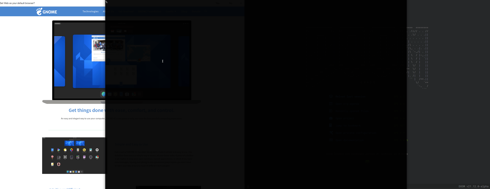

# One Third Window Gnome extension

Position window to a one third of the screen.

The idea of one third window is where you have a ultra wide screen and rather
wanted to have a "large" centered window but keep some other windows (2 to be exact) on the
side.

This extension automate it, it add a shortcut (Super+c by default ) to always
center the current and another shortcut (Super+Shift+c) to rotate the postion
from Left to Right.

You can customize the pixel positionement as much as you want but the defaults should be sanes.

## Demo

## Installation

Simply head to the gnome extension webite and install it from there : 

https://extensions.gnome.org/extension/4615/one-third-window/

or clone this repository with git and do a `make install` to install it 
in your `~/.local/share/gnome-shell/extensions` directory.

## Settings

A few settings you can adjust :

**Enlarge Width**: How many pixels to enlarge the window with. It by default use one third of the screen and enlarge it by that value. It default to 400 but you can set it to 0 if you want true one third.

**Top Start**: How many pixels to add from the top position. It usually work in case you have a larger panel. It default to 25.

**Height Increase**: How many pixels to increase the window with, you usually
combine this with top start to get it pixel perfect you want. Default to 25

You can set the center or rotate shortcut to your liking.

## Acknowledgement

Most of that code comes from the wonderful
[tactile](https://gitlab.com/lundal/tactile) extension, and tactile is probably much
more flexible and configurable way for a titling windows and positioning experience.

If this extension is not flexible for you enough I greatly encourage you to check out **tactile**.
